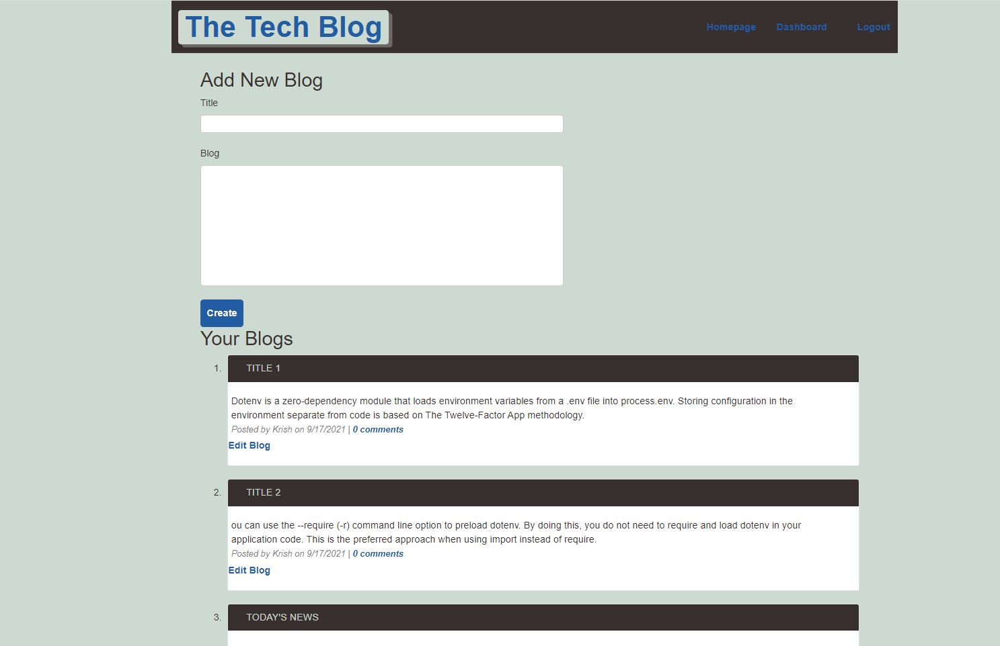
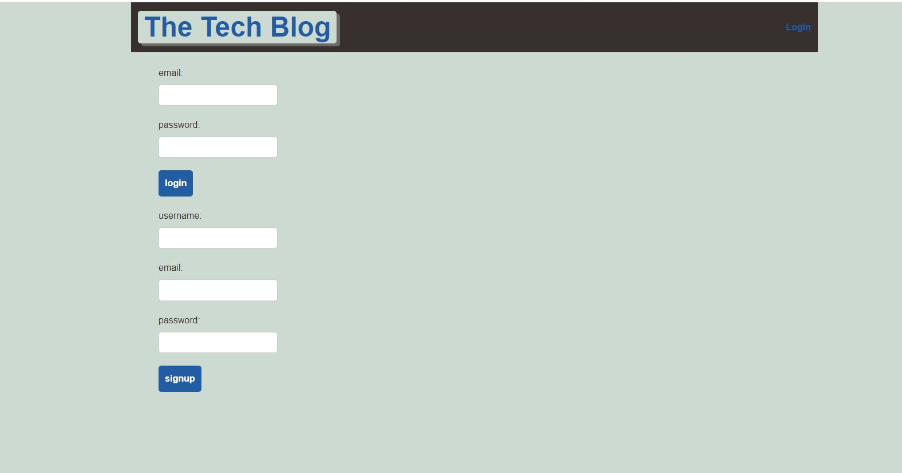
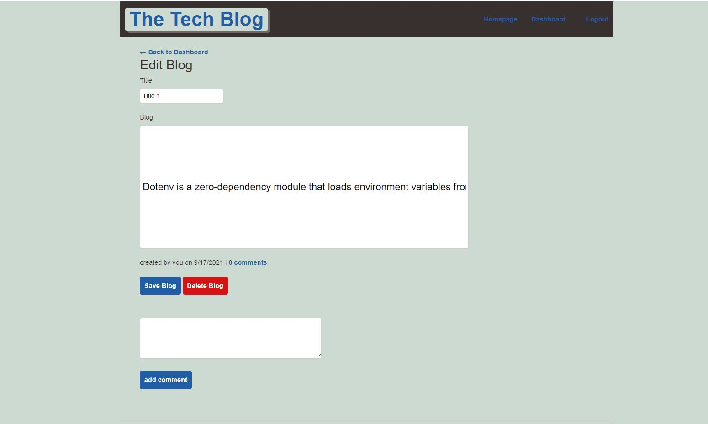

# Tech-Blog-Site

## Description :
```
Tech-Blog-Site App is session based CMS-style blog site. It offers techs to read others blog, post the blog, comment, edit and delete blogs. 
```

* The requirement to create Tech-Blog Site is as below :
```
AS A developer who writes about tech
I WANT a CMS-style blog site
SO THAT I can publish articles, blog posts, and my thoughts and opinions

GIVEN a CMS-style blog site
WHEN I visit the site for the first time
THEN I am presented with the homepage, which includes existing blog posts if any have been posted; navigation links for the homepage and the dashboard; and the option to log in
WHEN I click on the homepage option
THEN I am taken to the homepage
WHEN I click on any other links in the navigation
THEN I am prompted to either sign up or sign in
WHEN I choose to sign up
THEN I am prompted to create a username and password
WHEN I click on the sign-up button
THEN my user credentials are saved and I am logged into the site
WHEN I revisit the site at a later time and choose to sign in
THEN I am prompted to enter my username and password
WHEN I am signed in to the site
THEN I see navigation links for the homepage, the dashboard, and the option to log out
WHEN I click on the homepage option in the navigation
THEN I am taken to the homepage and presented with existing blog posts that include the post title and the date created
WHEN I click on an existing blog post
THEN I am presented with the post title, contents, post creator’s username, and date created for that post and have the option to leave a comment
WHEN I enter a comment and click on the submit button while signed in
THEN the comment is saved and the post is updated to display the comment, the comment creator’s username, and the date created
WHEN I click on the dashboard option in the navigation
THEN I am taken to the dashboard and presented with any blog posts I have already created and the option to add a new blog post
WHEN I click on the button to add a new blog post
THEN I am prompted to enter both a title and contents for my blog post
WHEN I click on the button to create a new blog post
THEN the title and contents of my post are saved and I am taken back to an updated dashboard with my new blog post
WHEN I click on one of my existing posts in the dashboard
THEN I am able to delete or update my post and taken back to an updated dashboard
WHEN I click on the logout option in the navigation
THEN I am signed out of the site
WHEN I am idle on the site for more than a set time
THEN I am able to view comments but I am prompted to log in again before I can add, update, or delete comments
```

## Languages and other components used : 
```
   * Node.js 
   * npm (node package manager) 
   * Expess.js server ( Node based web server ) 
   * MySQL (Structured Query Language) database
   * express-session, connect-seession-sequelize
   * dotenv, bcrypt 
```

## How to install : 
 ```
 To install the application in your computer follow the steps below: 

 1. Clone the repository in your computer :
    - open the command line and go to the directory where you want to clone the repository.
    - then clone the repo by typing : " git clone git@github.com:miraj00/Tech-Blog-Site.git "

 2. Install MySQL in your computer. 

 3. Install node.js on your computer by going to https://nodejs.org/en/  
  
 4. Then install below packages by typing in command line :

    - npm init -y
    - npm install express sequelize mysql2
    - npm install dotenv  
    - npm install bcrypt
    - npm i express-session connect-session-sequelize
    - npm install express-handlebars
    
5. Create files / folders such as : 
    - Create Server.js 
    - Setup .env file with database ID and Password
    - Create folders : config, db, public, utils, models, views, controllers
 
 
 7. Use " mysql -u root -p " to start MySQL Server, then enter password upon prompt 

 8. Once SQL is on, type : " source db/schema.sql; " to create database 

 9. Then You can use " exit " or " Quit " to stop the server.

 10. In command line type : " npm run seed " to seed the database if any 

 11. Then type : ' node server ' to invoke the application.

 You can go to  http://localhost:3001/  in browser and test the APP for all functions
```


## Below is the screenshot and Deployed application of the Project as per client request ## 







## Deployed Sites ##

[Please click here to see deployed application on Github](https://github.com/miraj00/Tech-Blog-Site)

[Please click here to see deployed application on heroku](https://desolate-badlands-81062.herokuapp.com/)


